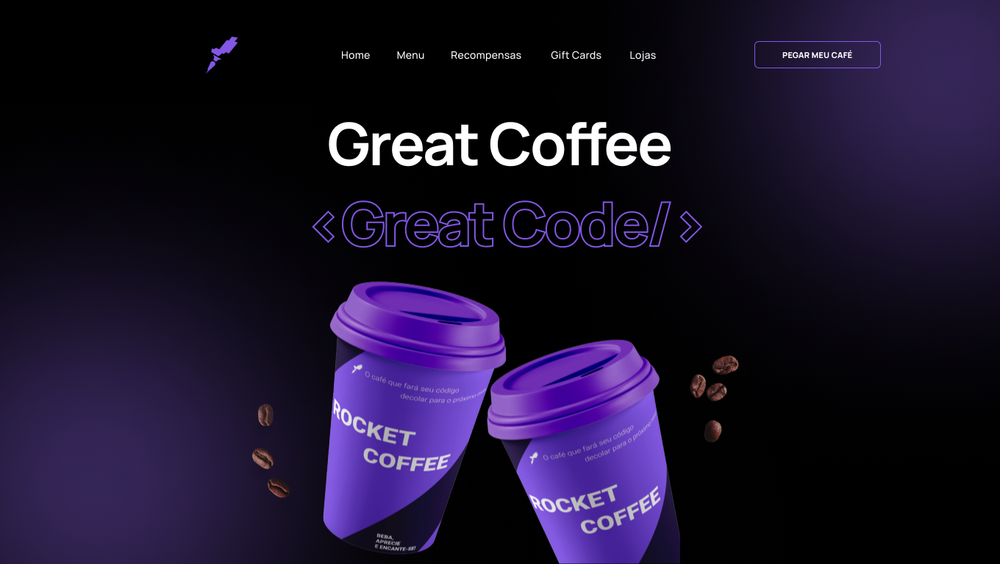
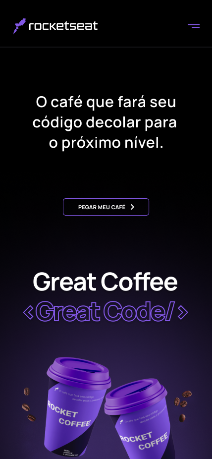
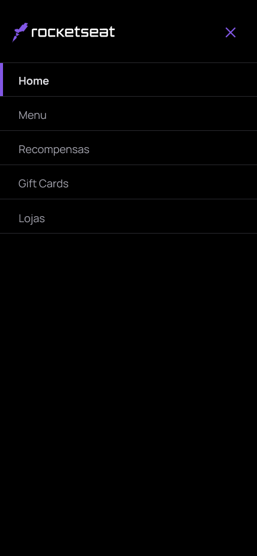

# RocketShoes

## Projeto 💻
Projeto de um desafio da Rocketseat desenvolver uma homepage para uma marca de café.

## Layout 🔖
Segue abaixo o layout deste projeto:
- [Figma](https://www.figma.com/file/oWvfDziP6d2NIRRPLw1G3N/DD-%2F-RocketCoffee-(Copy)?node-id=317-228&t=qKo2n8cIC4EnS1sx-0)

## Instalação 🛠
Siga esses passos para instalar o repositório na sua máquina:
1. Rode `git clone https://github.com/marcosfmd/rocket-coffee` para fazer um clone desse repositório.
2. Abra o arquivo HTML.

## Tecnologias 🚀
As tecnologias utilizadas neste projeto são:
- HTML
- CSS
- JavaScipt
- Google Fonts
- Git e GitHub

## Deploy 🚀

- [Projeto hospedador](https://marcosfmd.github.io/rocket-coffee)

## Créditos ❤️